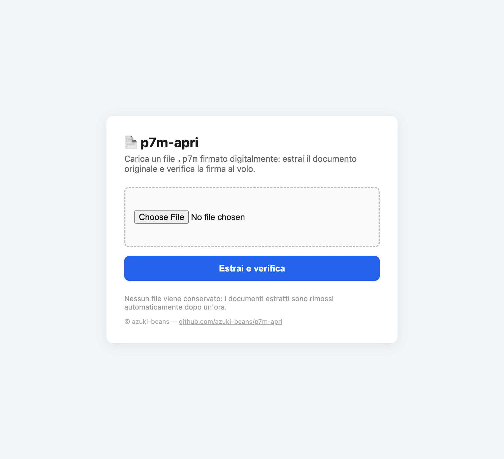

<p align="center">
  
</p>

# p7m-apri

Estrai il documento originale (di solito un PDF) da un file `.p7m`, cioè un file
firmato digitalmente — quelli che in Italia hanno valore legale. Carichi il
`.p7m`, l'app tira fuori il documento e verifica la firma. Tutto nel browser, in
pochi secondi.

> Nessun file viene conservato: i documenti estratti sono cancellati automaticamente dopo un'ora.

Spuntando l'opzione **«Verifica anche la validità legale della firma (eIDAS)»**
l'app non si limita a controllare l'integrità, ma verifica che il certificato
del firmatario sia riconosciuto dalle EU Trusted List (i prestatori qualificati,
inclusi quelli italiani accreditati AgID). Questa verifica è più lenta e
richiede connessione a Internet.



## Avvio rapido (in locale)

Serve solo [Docker](https://docs.docker.com/get-docker/) **oppure**
[Podman](https://podman.io/). Non devi installare né scaricare altro: l'immagine
è già pronta su GitHub.

```bash
# Docker
docker run --rm -p 8000:8000 -v p7m-apri-data:/data ghcr.io/azuki-beans/p7m-apri:latest

# Podman
podman run --rm -p 8000:8000 -v p7m-apri-data:/data ghcr.io/azuki-beans/p7m-apri:latest
```

Poi apri il browser su **<http://localhost:8000>** e carica il tuo `.p7m`.

## Metterlo su un server (Docker Compose)

```bash
git clone https://github.com/azuki-beans/p7m-apri.git
cd p7m-apri

cp .env.example .env       # imposta almeno DJANGO_SECRET_KEY
docker compose up -d       # con Podman: podman compose up -d
```

Il servizio si riavvia da solo (`restart: unless-stopped`) e conserva il proprio
database nel volume `p7m-apri-data`. Per aggiornarlo all'ultima versione:
`docker compose pull && docker compose up -d`.

### Variabili d'ambiente

| Variabile | A cosa serve |
|---|---|
| `DJANGO_SECRET_KEY` | Chiave segreta (obbligatoria in produzione). |
| `DJANGO_ALLOWED_HOSTS` | Domini consentiti, es. `p7m.azienda.it`. |
| `CSRF_TRUSTED_ORIGINS` | Origini fidate con schema, es. `https://p7m.azienda.it`. |
| `DJANGO_DEBUG` | `1`/`0` (default `0`). |
| `DJANGO_DB_PATH` | Percorso del database SQLite. |
| `TRUST_LIST_CACHE_DIR` | Cache delle EU Trusted List per la validazione eIDAS. |
| `TRUST_LIST_TERRITORIES` | Paesi delle Trusted List, es. `IT` (default) o `IT,FR`; vuoto = tutta la UE. |
| `SIGNATURE_REVOCATION_MODE` | Controllo revoca: `soft-fail` (default), `hard-fail`, `require`. |
| `SIGNATURE_TIME_TOLERANCE` | Tolleranza in secondi sui tempi OCSP/CRL (default `60`); alza il valore se l'orologio del server è impreciso. |
| `PORT` | Porta su cui ascoltare (default `8000`); Cloud Run e simili la impostano da soli. |
| `UMAMI_SRC` | URL dello script Umami (es. `https://cloud.umami.is/script.js`); vuoto = nessun analytics. |
| `UMAMI_WEBSITE_ID` | ID del sito su Umami; va valorizzato insieme a `UMAMI_SRC`. |

## Deploy gratuito su Google Cloud Run

Cloud Run esegue il container senza volumi e scala a zero quando nessuno lo usa
(rientra nel free tier). Il filesystem è effimero: il DB SQLite e la cache delle
Trusted List vivono solo finché l'istanza è attiva, quindi dopo un avvio a
freddo la **prima** verifica eIDAS torna lenta (riscarica la LOTL). Per
l'estrazione dei PDF non cambia nulla.

Serve l'[SDK gcloud](https://cloud.google.com/sdk/docs/install) e un progetto GCP.

```bash
# 1. Imposta il progetto e abilita le API necessarie
gcloud config set project IL-TUO-PROGETTO
gcloud services enable run.googleapis.com cloudbuild.googleapis.com artifactregistry.googleapis.com

# 2. Primo deploy: builda dal Dockerfile e pubblica il servizio
gcloud run deploy p7m-apri \
  --source . \
  --region europe-west1 \
  --allow-unauthenticated \
  --memory 512Mi \
  --set-env-vars DJANGO_SECRET_KEY=$(python -c "import secrets;print(secrets.token_urlsafe(50))")
```

Al termine `gcloud` stampa l'URL del servizio (es.
`https://p7m-apri-xxxx.europe-west1.run.app`). Le richieste `POST` del form
hanno bisogno che quell'origine sia fidata, quindi aggiornala subito:

```bash
# 3. Comunica a Django il proprio dominio (usa l'URL ottenuto sopra)
gcloud run services update p7m-apri --region europe-west1 \
  --update-env-vars DJANGO_ALLOWED_HOSTS=p7m-apri-xxxx.europe-west1.run.app,CSRF_TRUSTED_ORIGINS=https://p7m-apri-xxxx.europe-west1.run.app
```

Per attivare gli analytics Umami aggiungi nello stesso modo
`UMAMI_SRC` e `UMAMI_WEBSITE_ID`. Per aggiornare l'app in futuro basta
rilanciare il comando `gcloud run deploy --source .`.

### Chiave segreta con Secret Manager (consigliato in produzione)

Passare `DJANGO_SECRET_KEY` tra le env la lascia in chiaro nella configurazione
del servizio. Meglio custodirla in **Secret Manager** e farla leggere a Cloud
Run a runtime.

```bash
# 1. Abilita l'API e crea il secret con un valore casuale
gcloud services enable secretmanager.googleapis.com
python -c "import secrets;print(secrets.token_urlsafe(50))" \
  | gcloud secrets create django-secret-key --data-file=-

# 2. Concedi al service account di Cloud Run il permesso di leggerlo
PROJECT_NUMBER=$(gcloud projects describe $(gcloud config get-value project) --format='value(projectNumber)')
gcloud secrets add-iam-policy-binding django-secret-key \
  --member="serviceAccount:${PROJECT_NUMBER}-compute@developer.gserviceaccount.com" \
  --role="roles/secretmanager.secretAccessor"

# 3. Collega il secret alla variabile d'ambiente (al posto di --set-env-vars DJANGO_SECRET_KEY=...)
gcloud run services update p7m-apri --region europe-west1 \
  --update-secrets DJANGO_SECRET_KEY=django-secret-key:latest
```

`:latest` segue automaticamente l'ultima versione: per ruotare la chiave basta
aggiungere una nuova versione al secret (`gcloud secrets versions add
django-secret-key --data-file=-`) e riavviare il servizio. Lo stesso meccanismo
vale per qualsiasi altra variabile sensibile.

## Compilare l'immagine da sorgente

Se vuoi buildare tu invece di usare quella pubblica:

```bash
git clone https://github.com/azuki-beans/p7m-apri.git
cd p7m-apri
docker build -t p7m-apri .
docker run --rm -p 8000:8000 -v p7m-apri-data:/data p7m-apri
```

## Come funziona (sotto il cofano)

Dietro le quinte è una sola chiamata a OpenSSL:

```bash
openssl smime -verify -in documento.pdf.p7m -inform DER -noverify -out documento.pdf
```

- `-inform DER` — i `.p7m` sono codificati in DER.
- `-noverify` — salta la validazione della catena di certificati CA (così non
  servono i certificati root installati), ma l'integrità della firma viene
  comunque verificata.
- Il nome dell'output mantiene l'estensione interna: `documento.pdf.p7m` →
  `documento.pdf`. Se il `.p7m` non la conteneva (`documento.p7m`), l'output sarà
  `documento` e dovrai aggiungere l'estensione a mano.

## Licenza

Distribuito con licenza [MIT](LICENSE). © azuki-beans.
