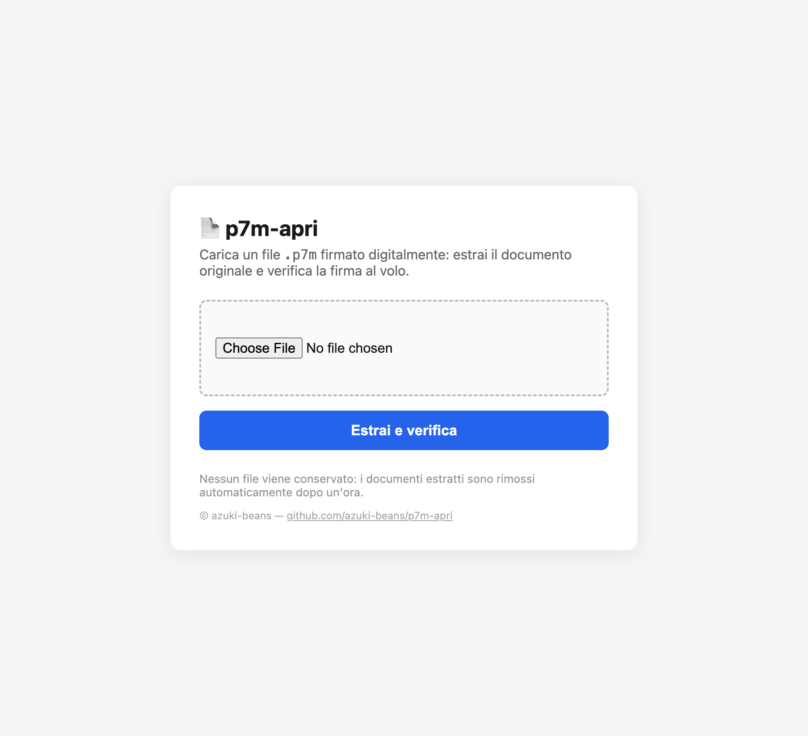
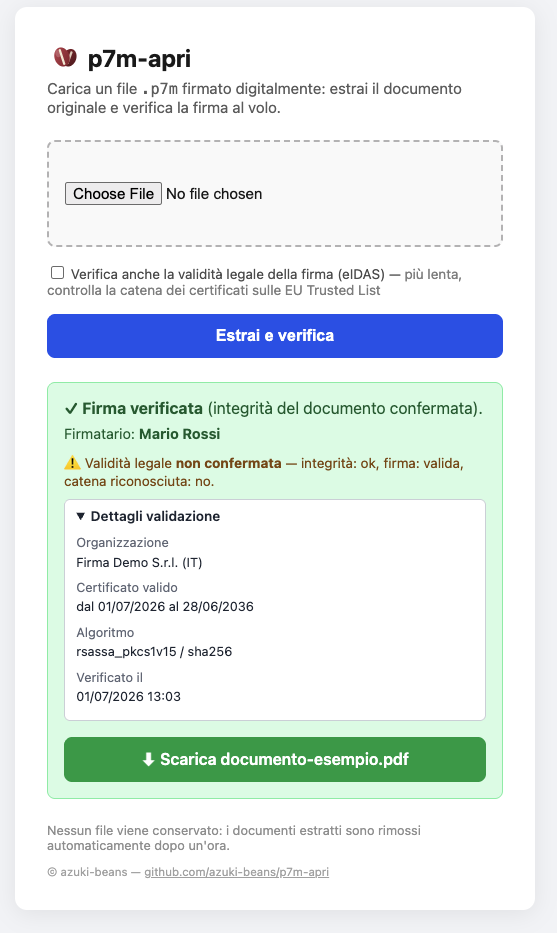
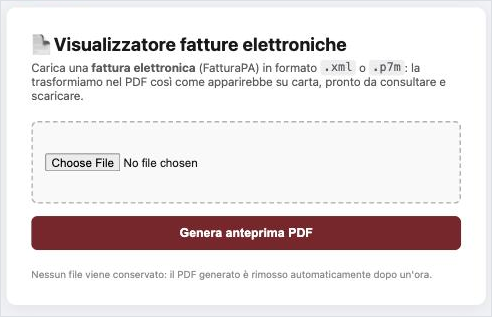
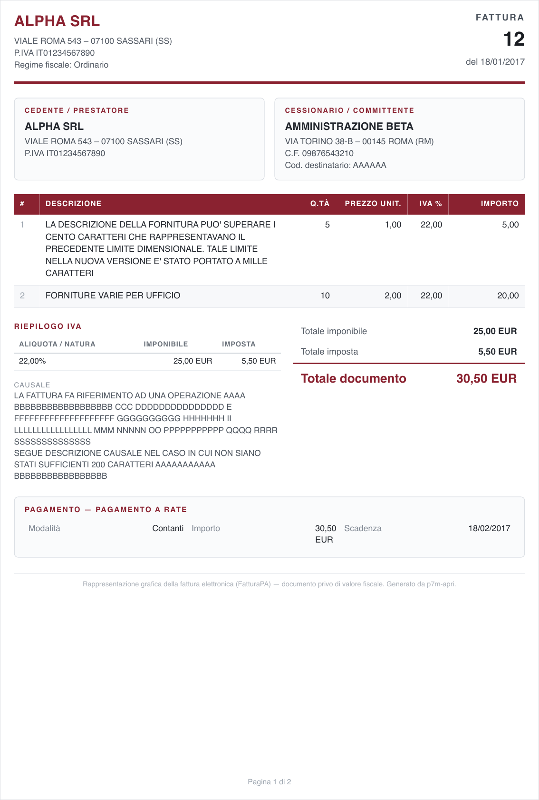
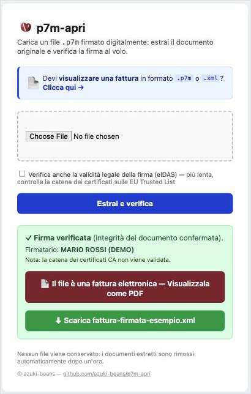

<p align="center">
  
</p>

# p7m-apri

Estrai il documento originale (di solito un PDF) da un file `.p7m`, cioè un file
firmato digitalmente — quelli che in Italia hanno valore legale. Carichi il
`.p7m`, l'app tira fuori il documento e verifica la firma. Tutto nel browser, in
pochi secondi.

> **Demo online:** <https://p7m-apri-42412551187.europe-west8.run.app>
> — provala subito, senza installare nulla. È un'istanza dimostrativa: non
> caricare documenti riservati e tieni presente che la prima verifica eIDAS può
> essere lenta (l'istanza scala a zero quando inutilizzata).

> Nessun file viene conservato: i documenti estratti sono cancellati automaticamente dopo un'ora.

Spuntando l'opzione **«Verifica anche la validità legale della firma (eIDAS)»**
l'app non si limita a controllare l'integrità, ma verifica che il certificato
del firmatario sia riconosciuto dalle EU Trusted List (i prestatori qualificati,
inclusi quelli italiani accreditati AgID). Questa verifica è più lenta e
richiede connessione a Internet.



Ecco il risultato di una verifica andata a buon fine — i dati del firmatario
sono **fittizi**, generati con un certificato di test:



> Vuoi provare senza usare un tuo documento? Nel repo c'è un file di esempio già
> firmato con un'identità inventata:
> [`docs/esempio/documento-esempio.pdf.p7m`](docs/esempio/documento-esempio.pdf.p7m).
> Caricalo nell'app per riprodurre lo screenshot qui sopra.

## Visualizzare le fatture elettroniche (XML → PDF)

La stessa app include un **visualizzatore di fatture elettroniche**: carichi una
fattura **FatturaPA** in formato `.xml` (o `.p7m` firmato) e la vedi impaginata
come apparirebbe **su carta**, pronta da scaricare in PDF. La trovi su
**`/fatture/`** o dal link in home.

<p align="center">
  
  &nbsp;
  
</p>

> **Provalo:** nel repo ci sono alcune fatture di esempio (i tracciati ufficiali
> dell'Agenzia delle Entrate) in [`test_samples/`](test_samples/) — caricane una
> `.xml` per riprodurre lo screenshot qui sopra.

### Da un `.p7m` alla sua fattura

Le fatture arrivano spesso firmate come `.p7m`. Se apri un `.p7m` dalla home e il
contenuto è una fattura, l'app se ne accorge e ti propone di **visualizzarla in
PDF** con un clic, senza estrazione manuale (in alternativa puoi caricare il
`.p7m` direttamente su `/fatture/`). Nel repo c'è un esempio già firmato con
un'identità inventata:
[`test_samples/fattura-firmata-esempio.xml.p7m`](test_samples/fattura-firmata-esempio.xml.p7m).

<p align="center">
  
</p>

### Personalizzare l'aspetto

Il PDF si adatta al brand aziendale tramite due variabili d'ambiente:
`FATTURA_ACCENT` (colore principale in HEX) e `FATTURA_LOGO_URL` (URL del logo
mostrato in intestazione). Vedi la tabella più sotto.

### Usarlo come API

Lo stesso servizio è disponibile via HTTP: invia una fattura `.xml` o `.p7m` in
`POST` e ricevi il PDF.

```bash
# file multipart
curl -F file=@fattura.xml http://localhost:8000/fatture/api/pdf/ -o fattura.pdf

# byte grezzi nel corpo, con colore del tema personalizzato (%23 = '#')
curl --data-binary @fattura.xml.p7m \
     "http://localhost:8000/fatture/api/pdf/?accent=%231D4ED8" -o fattura.pdf
```

Parametri query opzionali: `accent` (HEX del tema), `dl=1` per forzare il
download, `filename` per il corpo grezzo. In caso di errore la risposta è JSON
`{"error": …}`.

## Avvio rapido (in locale)

Serve solo [Docker](https://docs.docker.com/get-docker/) **oppure**
[Podman](https://podman.io/). Non devi installare né scaricare altro: l'immagine
è già pronta su GitHub.

```bash
# Docker
docker run --rm -p 8000:8000 -v p7m-apri-data:/data ghcr.io/azuki-beans/p7m-apri:latest

# Podman
podman run --rm -p 8000:8000 -v p7m-apri-data:/data ghcr.io/azuki-beans/p7m-apri:latest
```

Poi apri il browser su **<http://localhost:8000>** e carica il tuo `.p7m`.

## Metterlo su un server (Docker Compose)

```bash
git clone https://github.com/azuki-beans/p7m-apri.git
cd p7m-apri

cp .env.example .env       # imposta almeno DJANGO_SECRET_KEY
docker compose up -d       # con Podman: podman compose up -d
```

Il servizio si riavvia da solo (`restart: unless-stopped`) e conserva il proprio
database nel volume `p7m-apri-data`. Per aggiornarlo all'ultima versione:
`docker compose pull && docker compose up -d`.

### Variabili d'ambiente

| Variabile | A cosa serve |
|---|---|
| `DJANGO_SECRET_KEY` | Chiave segreta (obbligatoria in produzione). |
| `DJANGO_ALLOWED_HOSTS` | Domini consentiti, es. `p7m.azienda.it`. |
| `CSRF_TRUSTED_ORIGINS` | Origini fidate con schema, es. `https://p7m.azienda.it`. |
| `DJANGO_DEBUG` | `1`/`0` (default `0`). |
| `DJANGO_DB_PATH` | Percorso del database SQLite. |
| `TRUST_LIST_CACHE_DIR` | Cache delle EU Trusted List per la validazione eIDAS. |
| `TRUST_LIST_TERRITORIES` | Paesi delle Trusted List, es. `IT` (default) o `IT,FR`; vuoto = tutta la UE. |
| `SIGNATURE_REVOCATION_MODE` | Controllo revoca: `soft-fail` (default), `hard-fail`, `require`. |
| `SIGNATURE_TIME_TOLERANCE` | Tolleranza in secondi sui tempi OCSP/CRL (default `60`); alza il valore se l'orologio del server è impreciso. |
| `FATTURA_ACCENT` | Colore principale del PDF fattura in HEX (default `#8A2230`). |
| `FATTURA_LOGO_URL` | URL assoluto del logo aziendale mostrato in intestazione fattura. |
| `PORT` | Porta su cui ascoltare (default `8000`); Cloud Run e simili la impostano da soli. |
| `UMAMI_SRC` | URL dello script Umami (es. `https://cloud.umami.is/script.js`); vuoto = nessun analytics. |
| `UMAMI_WEBSITE_ID` | ID del sito su Umami; va valorizzato insieme a `UMAMI_SRC`. |

## Deploy gratuito su Google Cloud Run

Cloud Run esegue il container senza volumi e scala a zero quando nessuno lo usa
(rientra nel free tier). Bastano l'[SDK gcloud](https://cloud.google.com/sdk/docs/install)
e un progetto GCP, poi `gcloud run deploy p7m-apri --source .`.

👉 **Guida passo-passo:** [docs/deploy-cloud-run.md](docs/deploy-cloud-run.md) —
primo deploy, dominio/CSRF e chiave segreta con Secret Manager.

## Compilare l'immagine da sorgente

Se vuoi buildare tu invece di usare quella pubblica:

```bash
git clone https://github.com/azuki-beans/p7m-apri.git
cd p7m-apri
docker build -t p7m-apri .
docker run --rm -p 8000:8000 -v p7m-apri-data:/data p7m-apri
```

## Come funziona (sotto il cofano)

Dietro le quinte è una sola chiamata a OpenSSL:

```bash
openssl smime -verify -in documento.pdf.p7m -inform DER -noverify -out documento.pdf
```

- `-inform DER` — i `.p7m` sono codificati in DER.
- `-noverify` — salta la validazione della catena di certificati CA (così non
  servono i certificati root installati), ma l'integrità della firma viene
  comunque verificata.
- Il nome dell'output mantiene l'estensione interna: `documento.pdf.p7m` →
  `documento.pdf`. Se il `.p7m` non la conteneva (`documento.p7m`), l'output sarà
  `documento` e dovrai aggiungere l'estensione a mano.

## Licenza

Distribuito con licenza [MIT](LICENSE). © azuki-beans.
